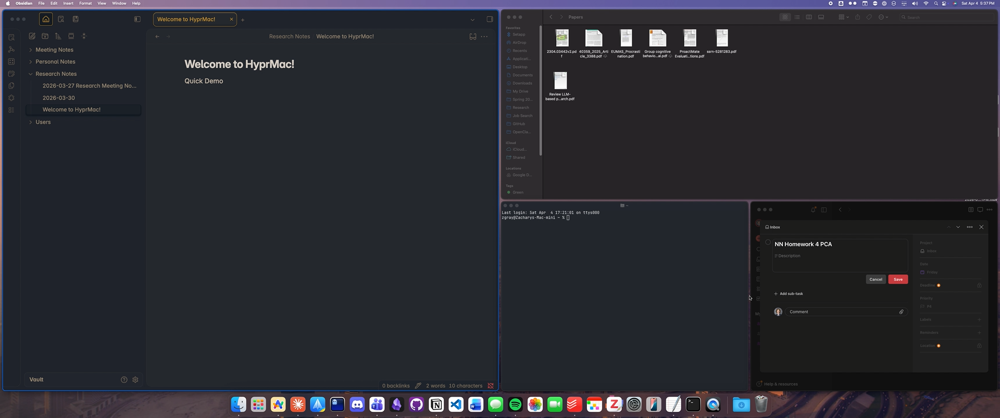

# HyprMac

A keyboard-driven tiling window manager for macOS.

Caps Lock becomes a **Hypr** modifier key by default, and the physical Hypr key can be changed in Settings. From there: BSP dwindle tiling, 9 virtual workspaces, directional focus and window swapping, drag-to-swap, and focus-follows-mouse — all without touching System Integrity Protection.

[](https://github.com/user-attachments/assets/1f6f12ff-8e89-49ab-8be9-f2996025763a)

> HyprMac is in active development. Contributions and bug reports are welcome.

---

## What It Solves

macOS doesn't ship with a tiling window manager. Third-party options either require disabling SIP, rely on AppleScript hacks, or bolt tiling on top of macOS Spaces in ways that feel fragile. HyprMac takes a different approach: it manages its own virtual workspaces in userspace, uses Accessibility APIs only, and provides a dedicated Hypr modifier for a clean, Hyprland-style workflow that works within macOS's constraints.

---

## Features

| | |
|---|---|
| 🪟 **BSP Dwindle Tiling** | Smart insertion with min-size adaptation and automatic split ratio adjustment |
| 🗂 **9 Virtual Workspaces** | Managed in userspace — no macOS Spaces dependency, no SIP needed |
| 🎯 **Directional Focus & Swap** | Move focus or swap windows left/right/up/down across monitors |
| 🖱 **Focus-Follows-Mouse** | Toggleable, with automatic suppression when menus are open |
| 🔄 **Drag-to-Swap** | Drag any window onto another to exchange positions |
| 🔲 **Floating Toggle** | Pop windows in and out of the tiling layout on demand |
| 🖥 **Multi-Monitor** | Per-monitor workspace assignment with directional cross-monitor navigation |
| ⌨️ **Fully Configurable** | Edit the Hypr key, keybinds, app launchers, gaps, and padding in-app or via JSON |
| 📋 **Keybind Overlay** | `Hypr+K` shows all active shortcuts at a glance |

---

## Requirements

- macOS 13 (Ventura) or later
- Accessibility permission — System Settings → Privacy & Security → Accessibility
- For the default Caps Lock Hypr key: Caps Lock set to **"⇪ Caps Lock"** in Modifier Keys (not "No Action")

---

## Installation

### Homebrew (recommended)

```sh
brew install --cask hyprmac
```

### Manual Download

Download the latest DMG from [GitHub Releases](https://github.com/zacharytgray/HyprMac/releases), open it, and drag HyprMac to Applications.

### Build from Source

```sh
git clone https://github.com/zacharytgray/HyprMac.git
cd HyprMac

brew install xcodegen
xcodegen generate

export DEVELOPMENT_TEAM=YOUR_TEAM_ID
xcodebuild -project HyprMac.xcodeproj -scheme HyprMac -configuration Debug \
  -derivedDataPath build DEVELOPMENT_TEAM=$DEVELOPMENT_TEAM build

cp -r build/Build/Products/Debug/HyprMac.app /Applications/
```

---

## Keybinds

All keybinds are configurable in Settings (menubar icon → Settings → Keybinds).
The physical Hypr key is configurable in Settings → General. Options include Caps Lock, Tab, backtick, backslash, F13-F20, and left/right variants of Shift, Control, Option, and Command.

### Defaults

| Shortcut | Action |
|----------|--------|
| `⇪ + ←/→/↑/↓` | Focus window in direction |
| `⇪ + ⇧ + ←/→/↑/↓` | Swap window in direction |
| `⇪ + J` | Toggle split direction |
| `⇪ + ⇧ + T` | Toggle floating/tiling |
| `⇪ + F` | Cycle focus through floating windows |
| `⇪ + 1–9` | Switch to workspace N |
| `⇪ + ⇧ + 1–9` | Move window to workspace N |
| `⇪ + ⌃ + ←/→` | Move workspace to adjacent monitor |
| `⇪ + K` | Show keybind overlay |
| `⇪ + ↵` | Launch/focus Terminal |
| `⇪ + \`` | Warp cursor to menu bar |

### Mouse

| Action | Effect |
|--------|--------|
| Hover over tiled window | Focus follows mouse (when enabled) |
| Drag window onto another | Swap positions |

---

## Menu Bar Access

Focus-follows-mouse and the macOS menu bar don't always play nicely together — mousing up to the menu bar can accidentally shift focus to a window underneath. HyprMac handles this two ways:

1. **Menu tracking detection** — FFM is automatically suppressed while any app's menu is open, so focus won't shift once you've clicked a menu item.
2. **`Hypr + \``** — Instantly warps the cursor to the menu bar on the current monitor. It's faster than mousing there manually and sidesteps the focus-switching problem entirely. The action, shortcut, and physical Hypr key are configurable in Settings.

---

## Virtual Workspaces

HyprMac manages 9 workspaces entirely in userspace, bypassing macOS Spaces.

- Workspaces are assigned to monitors left-to-right on launch (monitor 1 → ws 1, monitor 2 → ws 2, etc.)
- Each workspace remembers its **home monitor** — switching back returns it there
- Switching to a workspace that's already visible on another monitor focuses that monitor instead
- Inactive windows are hidden off-screen (a macOS constraint — one pixel remains visible in a corner)

A single macOS Space per monitor is recommended for the cleanest experience.

---

## Architecture

HyprMac is structured as a thin orchestration layer over a handful of focused services. Hotkeys feed into an `ActionDispatcher` that routes work to the right service; a polling loop drives a `WindowDiscoveryService` that detects new, gone, and drifted windows and hands the diff back to the dispatcher.

```
HotkeyManager (CGEventTap)
    └→ WindowManager.handleAction
        └→ ActionDispatcher.dispatch
            ├→ FocusStateController       (focus id + visual border)
            ├→ WorkspaceOrchestrator      (workspace switch / move)
            ├→ FloatingWindowController   (toggle / cycle / raise)
            ├→ TilingEngine               (swap / split toggle / retile)
            └→ AppLauncherManager         (launch / focus)
                ↓
        WindowStateCache mutations
                ↓
        TilingEngine.applyLayout (two-pass via FrameReadbackPoller)
                ↓
        FocusBorder, DimmingOverlay, WindowAnimator (visual layer)
```

Polling and discovery run in parallel:

```
PollingScheduler (1 Hz timer + coalesced notification triggers)
    └→ WindowDiscoveryService.computeChanges
        └→ ActionDispatcher.applyChanges
```

Window-keyed state lives in `WindowStateCache`; focus state in `FocusStateController`; date-gated suppressions (`activation-switch`, `mouse-focus`, `cross-swap-in-flight`) in `SuppressionRegistry`. BSP trees live in `TilingEngine` (one per `(workspace, screen)` pair) with smart insert backtracking on constrained monitors and two-pass min-size resolution via `FrameReadbackPoller`.

Everything runs on the main thread. UI-touching classes (`FocusBorder`, `DimmingOverlay`, `KeybindOverlayController`, `CursorManager`, `WindowAnimator`, `MouseTrackingManager`) assert this in DEBUG via `mainThreadOnly()`.

For deeper reading:

- [`docs/architecture.md`](docs/architecture.md) — long-form architecture, ownership rules, threading.
- [`docs/tiling-algorithm.md`](docs/tiling-algorithm.md) — BSP dwindle, smart insert, two-pass layout, min-size memory.
- [`docs/coordinate-systems.md`](docs/coordinate-systems.md) — CG ↔ NS conversion, multi-monitor edge cases.
- [`docs/keybinds-and-actions.md`](docs/keybinds-and-actions.md) — `Action` enum, frozen JSON case keys, schema versioning.
- [`docs/debugging.md`](docs/debugging.md) — Console.app filters, verbose-logging toggle, common debugging recipes.
- [`CLAUDE.md`](CLAUDE.md) — build/run, code style, key technical decisions.

---

## Updating

**In-app updates are recommended for most users.** HyprMac checks for updates automatically via Sparkle — when one is available, you'll be prompted to install it directly from the app. You can also check manually via the menubar icon → "Check for Updates..."

For Homebrew installs, `brew upgrade --cask hyprmac` works as well. Or download the latest DMG from [GitHub Releases](https://github.com/zacharytgray/HyprMac/releases) and replace the app manually.

> After any update method, macOS may ask you to re-grant Accessibility permission in System Settings, since the binary signature changes with each release.

---

## Inspired By

- [Hyprland](https://hyprland.org) — Wayland compositor, the primary inspiration for this project
- [yabai](https://github.com/koekeishiya/yabai) — macOS tiling WM
- [AeroSpace](https://github.com/nikitabobko/AeroSpace) — Swift macOS tiling WM with virtual workspaces
- [Amethyst](https://github.com/ianyh/Amethyst) — macOS tiling WM
- [skhd](https://github.com/koekeishiya/skhd) — Hotkey daemon

---

## License

MIT
