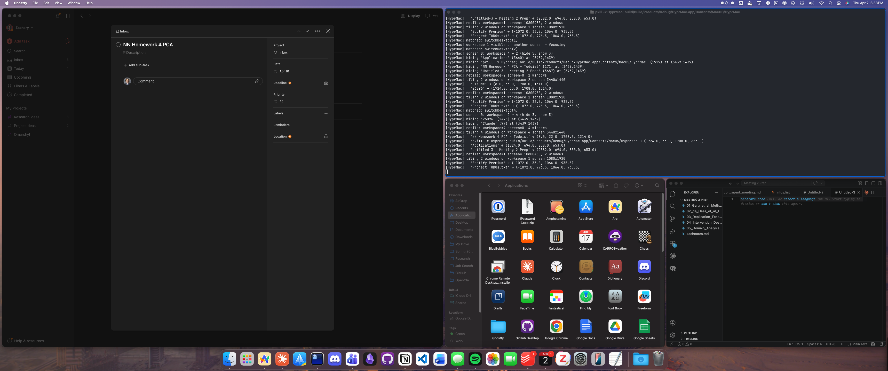

# HyprMac

A keyboard-driven tiling window manager for macOS, inspired by [Hyprland](https://hyprland.org/).

Caps Lock becomes a **Hypr** modifier key. BSP dwindle tiling, virtual workspaces, directional focus, window swapping, drag-swap, focus-follows-mouse — no SIP required.



> [!NOTE]
> HyprMac is in active development. Contributions and bug reports welcome.

## Features

- **BSP dwindle tiling** with smart insertion, min-size adaptation, and split ratio auto-adjustment
- **9 virtual workspaces** — switch with `Hypr+1-9`, move windows with `Hypr+Shift+1-9`
- **Directional focus & swap** across monitors
- **Toggle split** to transpose horizontal/vertical
- **Floating toggle** — pop windows out of tiling and back in
- **Drag-swap** — drag a window onto another to swap positions
- **Focus-follows-mouse** (toggleable)
- **App launcher** — bind any key to launch/focus an app
- **Keybind overlay** — `Hypr+K` to see all shortcuts
- **Multi-monitor** with per-monitor workspace assignment
- **Fully configurable** — edit keybinds, app launchers, gaps, and padding in-app or via JSON config

## Requirements

- macOS 13+ (Ventura or later)
- Accessibility permission (System Settings → Privacy → Accessibility)
- Caps Lock set to "⇪ Caps Lock" in Modifier Keys (not "No Action")

## Installation

### Homebrew (recommended)

```bash
brew install --cask hyprmac
```

### Manual Download

Download the latest DMG from [GitHub Releases](https://github.com/zacharytgray/HyprMac/releases), open it, and drag HyprMac to Applications.

### Build from Source

```bash
git clone https://github.com/zacharytgray/HyprMac.git
cd HyprMac

brew install xcodegen
xcodegen generate

export DEVELOPMENT_TEAM=YOUR_TEAM_ID
xcodebuild -project HyprMac.xcodeproj -scheme HyprMac -configuration Debug \
  -derivedDataPath build DEVELOPMENT_TEAM=$DEVELOPMENT_TEAM build

cp -r build/Build/Products/Debug/HyprMac.app /Applications/
```

### First Launch

1. Open HyprMac — it appears in the menubar
2. Grant Accessibility permission when prompted
3. Relaunch after granting permission

## Keybinds

All keybinds are configurable in Settings (menubar icon → Settings → Keybinds).

### Defaults

| Shortcut | Action |
|---|---|
| `⇪ + ←/→/↑/↓` | Focus window in direction |
| `⇪ + ⇧ + ←/→/↑/↓` | Swap window in direction |
| `⇪ + J` | Toggle split direction |
| `⇪ + ⇧ + T` | Toggle floating/tiling |
| `⇪ + F` | Cycle focus through floating windows |
| `⇪ + 1-9` | Switch to workspace N |
| `⇪ + ⇧ + 1-9` | Move window to workspace N |
| `⇪ + ⌃ + ←/→` | Move workspace to adjacent monitor |
| `⇪ + K` | Show keybind overlay |
| `⇪ + ↵` | Launch/focus Terminal |
| `⇪⇪` (double-tap) | Warp cursor to menu bar |

### Mouse

| Action | Effect |
|---|---|
| Hover over tiled window | Focus follows mouse |
| Drag window onto another | Swap positions |

### Menu Bar Access

With focus-follows-mouse enabled, moving the mouse to the menu bar can accidentally focus a tiled window along the way. HyprMac handles this two ways:

1. **Menu tracking detection** — FFM is automatically suppressed while any app's menu dropdown is open, so you won't lose the menu once you've clicked it.
2. **Double-tap Caps Lock** — Instantly warps your cursor to the menu bar on the current monitor. Faster than mousing up there, and avoids the focus-switching problem entirely. Configurable in Settings → General (change the action or disable it).

## Virtual Workspaces

HyprMac manages 9 global workspaces in userspace, bypassing macOS Spaces entirely. No SIP required.

- Workspaces are assigned to monitors left-to-right on startup (monitor 1 → ws 1, monitor 2 → ws 2)
- Each workspace remembers its **home monitor** — switching back returns it there
- Switching to a workspace already visible on another monitor focuses that monitor
- Inactive windows are hidden off-screen (1px visible in corner — macOS limitation)

Recommended: use a single macOS Space per monitor.

## Updating

- **Homebrew**: `brew upgrade --cask hyprmac`
- **In-app**: HyprMac checks for updates automatically via Sparkle. You can also check manually from the menubar → "Check for Updates..."
- **Manual**: Download the latest DMG from [GitHub Releases](https://github.com/zacharytgray/HyprMac/releases) and replace the app in `/Applications`

After updating, you may need to re-grant Accessibility permission in System Settings since the binary signature changes.

## Known Limitations

- **Floating window z-order flicker** — When you click a tiled window from a different app, floating windows may briefly dip behind tiled windows before popping back to the front. This is a macOS limitation: setting another process's window level requires SIP to be disabled (yabai solves this via Dock.app code injection; [AeroSpace has had an open issue](https://github.com/nikitabobko/AeroSpace/issues/4) for 2+ years with no SIP-compatible solution). HyprMac uses focus-without-raise (same SkyLight private APIs as yabai/Amethyst) for hover focus, and event-driven re-raise on app activation to keep floating windows on top. HyprMac's own settings window is unaffected since `NSWindow.level = .floating` works for in-process windows.
- **Accessibility re-prompt after update** — macOS may require re-granting Accessibility permission after updating, since the binary signature changes.

## Roadmap

- Workspace overflow (auto-send to next workspace when monitor is full)
- Resize mode (`Hypr+R` + arrows)
- Scratchpad windows
- Window rules (auto-float, workspace assignment)
- Animations

## Inspired By

- [Hyprland](https://hyprland.org/) — Wayland compositor, the model for this project
- [yabai](https://github.com/koekeishiya/yabai) — macOS tiling WM
- [AeroSpace](https://github.com/nikitabobko/AeroSpace) — Swift macOS tiling WM with virtual workspaces
- [Amethyst](https://github.com/ianyh/Amethyst) — macOS tiling WM
- [skhd](https://github.com/koekeishiya/skhd) — Hotkey daemon

## License

MIT
